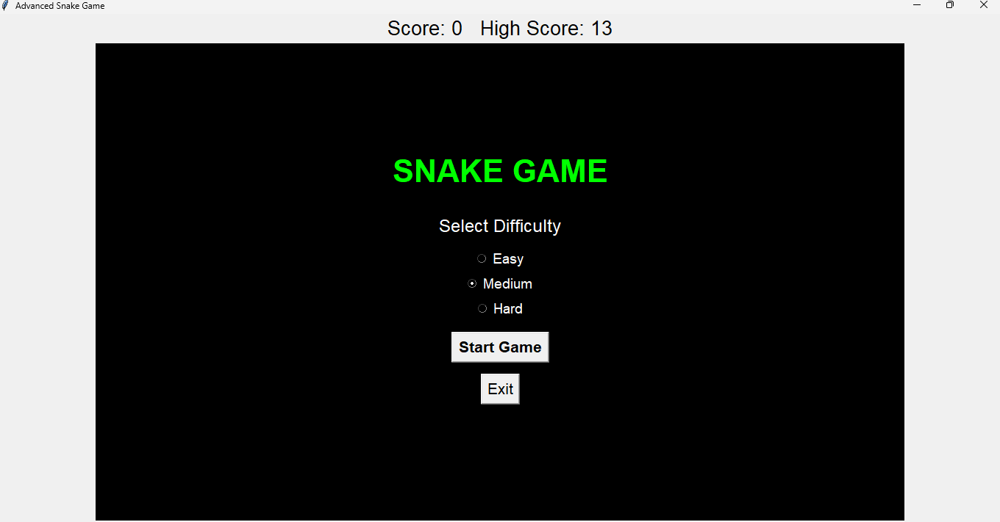
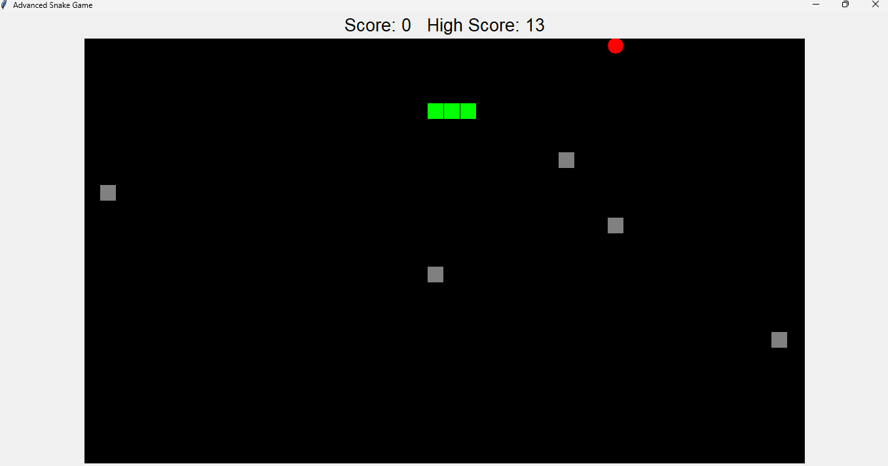
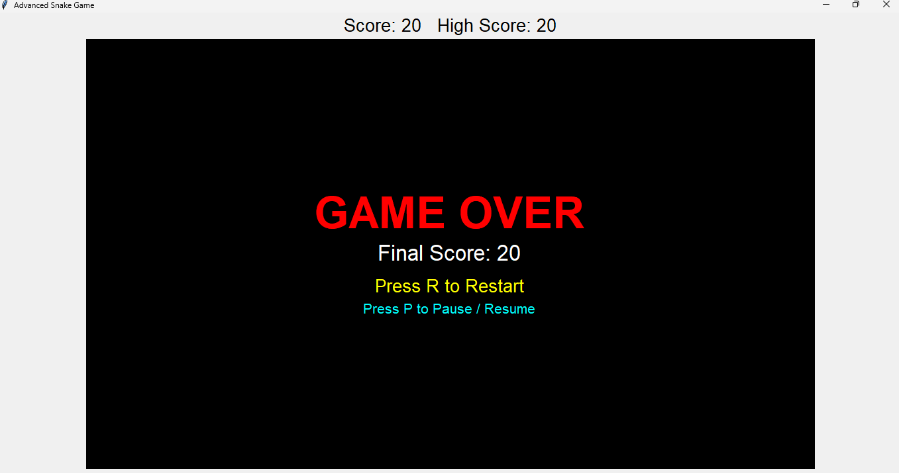

# 🐍 Advanced Snake Game

A classic Snake Game developed using Python and Tkinter with modern gameplay features and an interactive GUI.

## 🎮 Features

- Snake movement using arrow keys
- Screen wrapping
- Food generation
- Score tracking
- Persistent high score
- Easy, Medium and Hard difficulty levels
- Random obstacles
- Self-collision detection
- Obstacle collision detection
- Pause and Resume
- Restart functionality
- Game Over screen
- High score stored using JSON
- Interactive Start Menu

## 🛠️ Technologies Used

- Python
- Tkinter
- JSON
- Random
- OS

## 🎯 Controls

| Key | Action |
|---|---|
| ⬆️ Up | Move Up |
| ⬇️ Down | Move Down |
| ⬅️ Left | Move Left |
| ➡️ Right | Move Right |
| P | Pause / Resume |
| R | Restart |

## ⚙️ Difficulty Levels

### Easy
Slower snake speed for beginners.

### Medium
Balanced gameplay.

### Hard
Faster snake speed for a greater challenge.

## ▶️ How to Run

1. Install Python.
2. Clone or download this repository.
3. Open the project folder in VS Code.
4. Run:

```bash
python snake_game.py

## 📸 Screenshots

### Start Menu



### Gameplay



### Game Over

